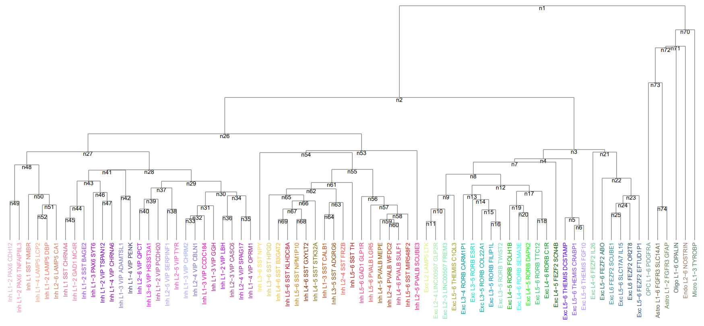

# scTreeShap

When doing single-cell RNA sequencing work, we firstly do clustering by community detection. Then we match the clusters to major cell types, which forms a cluster tree.



We usually need to select a branch for analysis, which helps us investigate on gene differential expressions on cell subtypes. scTreeShap constructs a data structure, which helps us quickly filter data whose clusters are under a specific branch (or in a specific cluster set). Moreover, it can run shap automatically to indicate marker genes.

## Data Input and Filtering

An scTreeShap object construction needs a python dict reflecting the tree structure. Here is an example of the cluster tree above.

```python
from scTreeShap import scTreeShap

tree_arr = {
    "n1": ('n2', 'n70'),
    "n2": ('n26', 'n3'),
    "n3": ('n4', 'n21'),
    "n4": ('n7', 'n5'),
    "n5": ('Exc L5-6 THEMIS DCSTAMP', 'n6'),
    "n6": ('Exc L5-6 THEMIS CRABP1', 'Exc L5-6 THEMIS FGF10'),
    "n7": ('n8', 'Exc L4-5 FEZF2 SCN4B'),
    "n8": ('n9', 'n12'),
    "n9": ('n10', 'Exc L5-6 THEMIS C1QL3'),
    "n10": ('n11', 'Exc L2-3 LINC00507 FREM3'),
    "n11": ('Exc L2 LAMP5 LTK', 'Exc L2-4 LINC00507 GLP2R'),
    "n12": ('n13', 'n17'),
    "n13": ('Exc L3-4 RORB CARM1P1', 'n14'),
    "n14": ('Exc L3-5 RORB ESR1', 'n15'),
    "n15": ('Exc L3-5 RORB COL22A1', 'n16'),
    "n16": ('Exc L3-5 RORB FILIP1L', 'Exc L3-5 RORB TWIST2'),
    "n17": ('n19', 'n18'),
    "n18": ('Exc L5-6 RORB TTC12', 'Exc L4-6 RORB C1R'),
    "n19": ('Exc L4-5 RORB FOLH1B', 'n20'),
    "n20": ('Exc L4-6 RORB SEMA3E', 'Exc L4-5 RORB DAPK2'),
    "n21": ('Exc L4-6 FEZF2 IL26', 'n22'),
    "n22": ('Exc L5-6 FEZF2 ABO', 'n23'),
    "n23": ('n24', 'Exc L5-6 FEZF2 EFTUD1P1'),
    "n24": ('n25', 'Exc L6 FEZF2 OR2T8'),
    "n25": ('Exc L6 FEZF2 SCUBE1', 'Exc L5-6 SLC17A7 IL15'),
    "n26": ('n27', 'n53'),
    "n27": ('n48', 'n28'),
    "n28": ('n41', 'n29'),
    "n29": ('n37', 'n30'),
    "n30": ('n31', 'n34'),
    "n31": ('n32', 'Inh L1-3 VIP GGH'),
    "n32": ('n33', 'Inh L1-3 VIP CCDC184'),
    "n33": ('Inh L1-3 VIP CHRM2', 'Inh L2-4 VIP CBLN1'),
    "n34": ('n36', 'n35'),
    "n35": ('Inh L2-4 VIP SPAG17', 'Inh L1-4 VIP OPRM1'),
    "n36": ('Inh L1-2 VIP LBH', 'Inh L2-3 VIP CASC6'),
    "n37": ('n39', 'n38'),
    "n38": ('Inh L2-5 VIP SERPINF1', 'Inh L2-5 VIP TYR'),
    "n39": ('n40', 'Inh L1-2 VIP PCDH20'),
    "n40": ('Inh L2-6 VIP QPCT', 'Inh L3-6 VIP HS3ST3A1'),
    "n41": ('n43', 'n42'),
    "n42": ('Inh L1-3 VIP ADAMTSL1', 'Inh L1-4 VIP PENK'),
    "n43": ('n44', 'n46'),
    "n44": ('n45', 'Inh L1-2 SST BAGE2'),
    "n45": ('Inh L1 SST CHRNA4', 'Inh L1−2 GAD1 MC4R'),
    "n46": ('Inh L1-3 PAX6 SYT6', 'n47'),
    "n47": ('Inh L1-2 VIP TSPAN12', 'Inh L1-4 VIP CHRNA6'),
    "n48": ('n49', 'n50'),
    "n49": ('Inh L1-2 PAX6 CDH12', 'Inh L1-2 PAX6 TNFAIP8L3'),
    "n50": ('Inh L1 SST NMBR', 'n51'),
    "n51": ('n52', 'Inh L2-6 LAMP5 CA1'),
    "n52": ('Inh L1-4 LAMP5 LCP2', 'Inh L1-2 LAMP5 DBP'),
    "n53": ('n54', 'Inh L2-5 PVALB SCUBE3'),
    "n54": ('Inh L3-6 SST NPY', 'n55'),
    "n55": ('n61', 'n56'),
    "n56": ('Inh L5-6 GAD1 GLP1R', 'n57'),
    "n57": ('Inh L5-6 PVALB LGR5', 'n58'),
    "n58": ('n59', 'Inh L5-6 SST MIR548F2'),
    "n59": ('Inh L4-5 PVALB MEPE', 'n60'),
    "n60": ('Inh L2-4 PVALB WFDC2', 'Inh L4-6 PVALB SULF1'),
    "n61": ('n62', 'Inh L5-6 SST TH'),
    "n62": ('n65', 'n63'),
    "n63": ('n64', 'Inh L2-4 SST FRZB'),
    "n64": ('Inh L1-3 SST CALB1', 'Inh L3-5 SST ADGRG6'),
    "n65": ('Inh L3-6 SST HPGD', 'n66'),
    "n66": ('n67', 'Inh L4-5 SST STK32A'),
    "n67": ('n69', 'n68'),
    "n68": ('Inh L5-6 SST NPM1P10', 'Inh L4-6 SST GXYLT2'),
    "n69": ('Inh L4-6 SST B3GAT2', 'Inh L5-6 SST KLHDC8A'),
    "n70": ('n71', 'Micro L1-3 TYROBP'),
    "n71": ('n72', 'Endo L2-6 NOSTRIN'),
    "n72": ('n73', 'Oligo L1-6 OPALIN'),
    "n73": ('OPC L1-6 PDGFRA', 'n74'),
    "n74": ('Astro L1-6 FGFR3 SLC14A1', 'Astro L1-2 FGFR3 GFAP')
}

Sample = scTreeShap(tree_arr)
```

The keys of the dict represent the name of each tree node, while the values represent the children of each node (the tree can be either binary or multi-children). Note that clusters do not need to be assigned as a key, since they are the leaf nodes in the tree and do not have children.

You can read in data by:

```python
Sample.readData(branch_name='n48', data_directory='./neuron_full.pkl', filetype='pkl')
```

where branch_name is your target branch, data_directory is the directory of the input file. It can be either a csv file or pkl file.

## Display Shap Figures

Build multi-classification model and generate shap figures:

```python
Sample.setBranch('n70')
Sample.setDataDirectory('./nonneuron_full.pkl')
Sample.setFileType('pkl')
Sample.setDataSet(Sample.readData())

Sample.explainMulti(
    use_SMOTE=False,
    shap_output_directory=None, # output shap values to shap_output_directory
    nthread=48, # multi-thread
    shap_params={
        "bar_plot": True,
        "beeswarm": False,
        "decision_plot": False
    }
)
```

Build binary-classification model and generate shap figures:

```python
Sample.setBranch('n70')
Sample.setDataDirectory('./nonneuron_full.pkl')
Sample.setFileType('pkl')
Sample.setDataSet(Sample.readData())
Sample.setCluster('Astro L1-2 FGFR3 GFAP')

Sample.explainBinary(
    use_SMOTE=False,
    shap_output_directory=None, # output shap values to shap_output_directory
    nthread=48, # multi-thread
    shap_params={
        "bar_plot": True,
        "beeswarm": True,
        "force_plot": False,
        "heat_map": False,
        "decision_plot": False
    }
)
```

